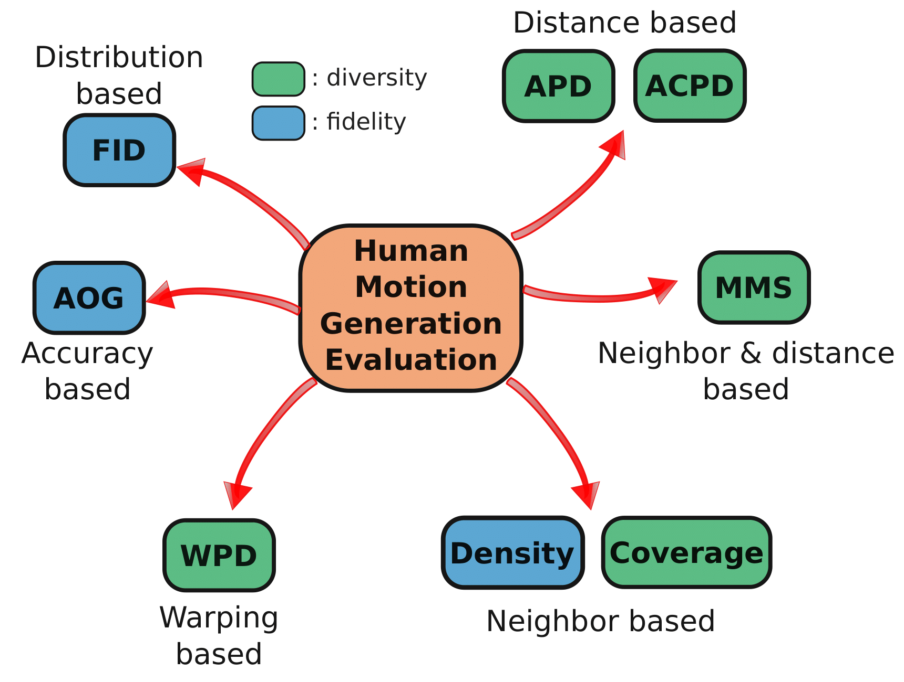
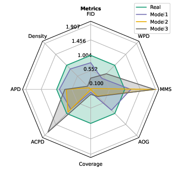

# Establishing a Unified Evaluation Framework for Human Motion Generation: A Comparative Analysis of Metrics

Authors: [Ali Ismail-Fawaz](https://hadifawaz1999.github.io/)<sup>1</sup>, [Maxime Devanne](https://maxime-devanne.com/)<sup>1</sup>, [Stefano Berretti](http://www.micc.unifi.it/berretti/)<sup>2</sup>, [Jonathan Weber](https://www.jonathan-weber.eu/)<sup>1</sup>, [Germain Forestier](https://germain-forestier.info/)<sup>1,3</sup>

<sup>1</sup> [MSD-IRIMAS, Université de Haute-Alsace, France](https://msd-irimas.github.io/)<br>
<sup>2</sup> [MICC, University of Florence, Italy](http://www.micc.unifi.it/)<br>
<sup>3</sup> [DSAI, Monash University, Australia](https://www.monash.edu/it/dsai)

This repository contains the source code to support the paper titled "Establishing a Unified Evaluation Framework for Human Motion Generation: A Comparative Analysis of Metrics".

## Abstract

Human motion generation within generative Artificial Intelligence has seen exponential growth, yet a unified evaluation framework is required.
This paper conducts a thorough review of eight evaluation metrics for human motion generation tasks, emphasizing their diverse attributes and limitations.
We advocate for standardized practices to enable fair model comparisons by proposing a unified evaluation setup.
Additionally, we introduce a novel metric designed to capture diversity in temporal distortion through the analysis of warping diversity, thus enriching the evaluation landscape for temporal data.
Furthermore, we present experimental analyses on three generative models using a publicly available dataset, illuminating the interpretations of each metric.
Our work aims to provide newcomers to the field with a clear and user-friendly evaluation setup, supported by easily accessible public code.

<p align="center">

</p>

## Requirements

This code requires the following packages to be installed (we used python version `3.10.12`):
```
aeon==0.8.1
numpy==1.26.4
pandas==2.0.3
tensorflow==2.16.1
matplotlib==3.8.4
scikit-learn==1.4.2
```

## Code Usage

In order to use the code to calculate the metrics on your generated data as well as on the real data in order to have a baseline for each metric, please use `METRIC_CALCULATOR` class in the [metric_calculator.py](https://github.com/MSD-IRIMAS/Evaluating-HMG/blob/main/metric_calculator.py) file. A full example using synthetic data and a simple generative model is presented in [example.ipynb](https://github.com/MSD-IRIMAS/Evaluating-HMG/blob/main/example.ipynb).

The `METRIC_CALCULATOR` class takes two input parameters:

1. `output_dir` to simply save the metric values in a csv file in this output directory chose, default to "./" (current directory).
2. A dictionary `args` where each key indicates the key word to the metrics the users chooses. For each of these keys, a sub-dictionary containing the parameters of each metric is chosen, one crucial parameter for each sub-dictionary is the `classifier`, a tensorflow-keras pre-trained model used for the metrics calculation.

Here is a list of metrics that can be used with their corresponding key word. Please check the docstring of each metric inside the `metrics/` directory for a detail view on the parameters of each metric.

```
==================================================
key-word          metric-name
==================================================
fid               Frechet Inception Distance
density           Density
coverage          Coverage
apd               Average Pair Distance
acpd              Average per Class Pair Distance
mms               Mean Maximum Similarity
aog               Accuracy On Generated
wpd               Warping Path Diversity
==================================================
```

Check the output example in [metrics.csv](https://github.com/MSD-IRIMAS/Evaluating-HMG/blob/main/metrics.csv).

## Plotting the Metrics

Supposing that you ran the code on all models you want to compare and you ended up with a csv file like the example in [metrics_models.csv](https://github.com/MSD-IRIMAS/Evaluating-HMG/blob/main/metrics_models.csv) than you can plot on a polygon radar chart the following figure:

<p align="center">

</p>

To construct the above figure, please simply run the file `plot_metrics_polygon` and make sure you set the [`csv_file`](https://github.com/MSD-IRIMAS/Evaluating-HMG/blob/4f3ac7b795edec38b9f412b3c4539ddfb220064c/plot_metrics_polygone.py#L300) parameter to the csv file you want to use for the plotting.


## Citing this Work

...

## Acknowledgments

This work was supported by the ANR DELEGATION project (grant ANR-21-CE23-0014) of the French Agence Nationale de la Recherche.
The authors would like to acknowledge the High Performance Computing Center of the University of Strasbourg for supporting this work by providing scientific support and access to computing resources.
Part of the computing resources were funded by the Equipex Equip@Meso project (Programme Investissements d’Avenir) and the CPER Alsacalcul/Big Data.
The authors would also like to thank the creators and providers of the HumanAct12 dataset.